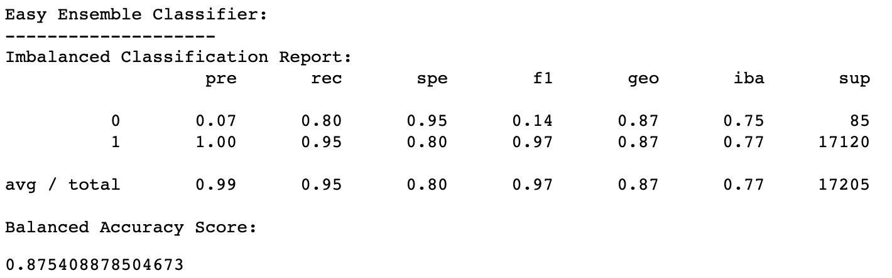

# Credit Risk Analysis

## Overview
The purpose of this analysis is to create several machine learning models that will predict if a loan is either "low risk" or "high risk." This is done by,
- gathering loan data in the form of a CSV file
- converting the file to a Pandas DataFrame
- converting all of the data to numeric values that can be handled by machine learning modules
- identifying and separating the target variable (low risk or high risk)
- identifying the features (the variables that will help the machine learning modules determine if a loan is high or low risk)
- splitting the data into training and testing sets
- applying different sampling methods
- training each module
- testing each module

After each model is tested, its performance is evaluated. Below, those analyses are broken down, and the overall performance of each model, as well as the perfromance of each model relative to the others is examined. 

## Results
### Random Oversampling

- Balanced Accuracy Score = 0.6605 - The model may predict accurately about 66.1% of the time
- Precision for High Risk category = 0.01 - The model performed very poorly at identifying only high risk debt as such
- Precision for Low Risk category = 1.00 - The model performed very well at idenitfying only low risk debt as such
- Recall for High Risk category = 0.71 - The model performed fairly well at identifying all high risk debt
- Recall for Low Risk category = 0.61 - The model performed moderately well at identifying all low risk debt

### SMOTE Oversampling

- Balanced Accuracy Score = 0.6172 - The model may predict accurately about 61.7% of the time
- Precision for High Risk category = 0.01 - The model performed very poorly at identifying only high risk debt as such
- Precision for Low Risk category = 1.00 - The model performed very well at idenitfying only low risk debt as such
- Recall for High Risk category = 0.57 - The model performed moderately well at identifying all high risk debt
- Recall for Low Risk category = 0.66 - The model performed moderately well at identifying all low risk debt

### Cluster Centroids Undersampling

- Balanced Accuracy Score = 0.5065 - The model may predict accurately about 50.7% of the time
- Precision for High Risk category = 0.01 - The model performed very poorly at identifying only high risk debt as such
- Precision for Low Risk category = 1.00 - The model performed very well at idenitfying only low risk debt as such
- Recall for High Risk category = 0.59 - The model performed moderately well at identifying all high risk debt
- Recall for Low Risk category = 0.43 - The model performed moderately poorly at identifying all low risk debt

### Combination Sampling with SMOTEENN

- Balanced Accuracy Score = 0.6471 - The model may predict accurately about 64.7% of the time
- Precision for High Risk category = 0.01 - The model performed very poorly at identifying only high risk debt as such
- Precision for Low Risk category = 1.00 - The model performed very well at idenitfying only low risk debt as such
- Recall for High Risk category = 0.74 - The model performed fairly well at identifying all high risk debt
- Recall for Low Risk category = 0.56 - The model performed moderately well at identifying all low risk debt

### Ensemble Learning with Balanced Random Forest Classifier

- Balanced Accuracy Score = 0.7432 - The model may predict accurately about 74.3% of the time
- Precision for High Risk category = 0.03 - The model performed very poorly at identifying only high risk debt as such
- Precision for Low Risk category = 1.00 - The model performed very well at idenitfying only low risk debt as such
- Recall for High Risk category = 0.60 - The model performed fairly well at identifying all high risk debt
- Recall for Low Risk category = 0.89 - The model performed well at identifying all low risk debt

### Easy Ensemble AdaBoost Classifier

- Balanced Accuracy Score = 0.8754 - The model may predict accurately about 87.5% of the time
- Precision for High Risk category = 0.07 - The model performed very poorly at identifying only high risk debt as such
- Precision for Low Risk category = 1.00 - The model performed very well at idenitfying only low risk debt as such
- Recall for High Risk category = 0.80 - The model performed well at identifying all high risk debt
- Recall for Low Risk category = 0.95 - The model performed very well at identifying all low risk debt

## Summary

### Comparisons

- Balanced Accuracy Score: Highest = Easy Ensemble --- Lowest = Cluster Centroids
- Recall for High Risk category: Highest = Easy Ensemble --- Lowest = SMOTE Oversampling
- Recall of Low Risk category: Highest = Easy Ensemble --- Lowest = Cluster Centroids Undersampling
- Precision: All models performed poorly in the High Risk category and exceptionally in the Low Risk category

### Recommendations
The overall best performing model of these 6 is the Easy Ensemble Classifier. With high recall scores and a balanced accuracy score of 0.8754, one could reasnably expect this model to be right fairly often. Unfortunately, however, all of these models, including Easy Ensemble, had horrible precision scores in the High Risk category. As a result, I could not recommend any of them. Although it is important to capture all high-risk loans, it is bad business for a lender to turn away low-risk loans and allow those borrows to move on to competitor lenders. 

All of these models could have been improved upon by scaling the data. The `sklearn.preprocessing` `StandardScaler` could have been used to this end. The data used here involves both very high and very low numbers. Many features were converted from plain language to numeric data. These values, along with others, are low numbers, between 0 and 10. Other data present here, like the loan amount and borrowers' income, are represented by much higher numbers, some in the tens or hundreds of thousands. These drastically different numbers can throw off classifiers. Scaling the data helps to make it easy for these models to interpret with higher accuracy. Another study should be conducted which includes scaling the data. 

